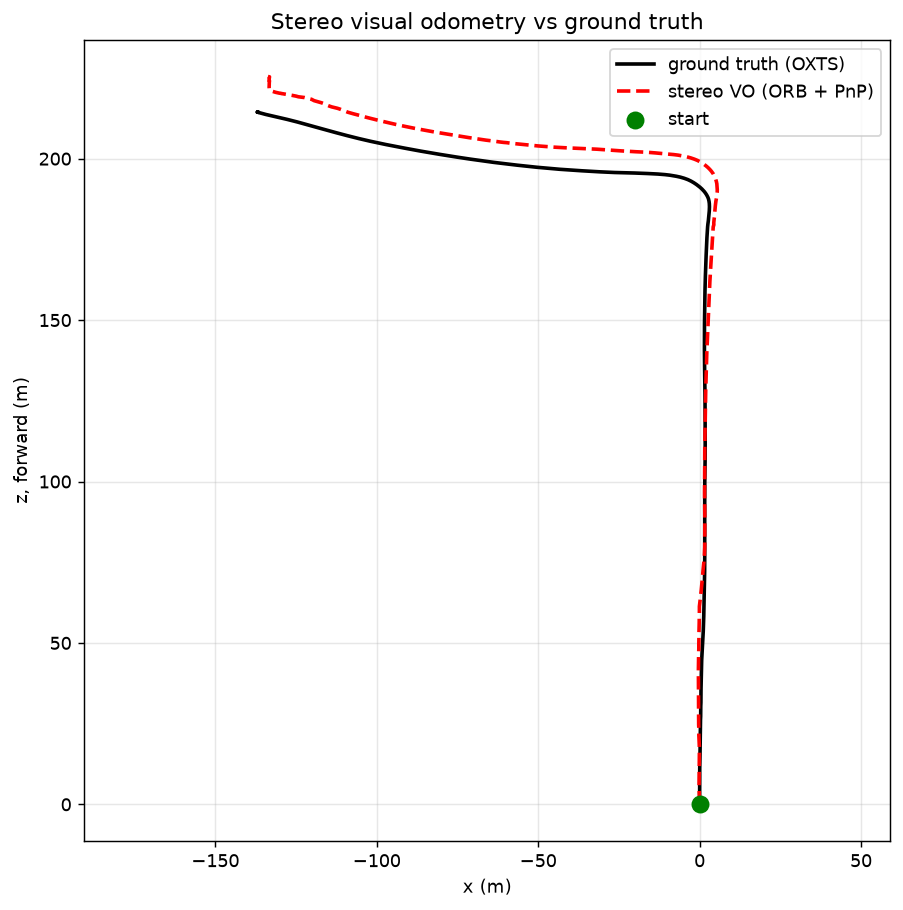

# kitti-nav

Autonomous-driving navigation on real recorded drives: replay a KITTI sequence, build the
occupancy/BEV representation a real AV stack actually plans on, and drive a vehicle through
it behind a **hard safety shield** that is provably unable to admit a collision it could
have braked out of.

Runs entirely on a laptop — pure NumPy core, no GPU, no simulator install.

> **Why occupancy and not splats?** Production AV stacks make live driving decisions on
> lidar/occupancy/BEV grids, not photorealistic reconstructions. Gaussian splatting's real
> role in AV work is *offline* — turning recorded drives into replayable digital twins for
> closed-loop testing. This repo keeps the live path on occupancy from the start.

## Status

| Piece | State |
| --- | --- |
| Kinematic bicycle (Ackermann) vehicle model | done, tested |
| Braking-aware safety shield | done, tested — incl. a fuzz test that found a real soundness bug |
| KITTI raw loading (stereo + lidar + OXTS ground truth) | done, verified on drive `2011_09_26_0009` |
| Stereo visual odometry (ORB + PnP) | done — **3.55% drift over 332.8 m at 26 fps CPU** |
| Lidar → BEV occupancy grid | next |
| Learned planner behind the shield | after the above |

45 tests pass; the dataset-backed ones skip cleanly when KITTI isn't downloaded.

## Quickstart

```bash
pip install -r requirements.txt
python3 scripts/fetch_kitti.py          # ~1.7 GB, drive 0009; --list for other options
python3 -m pytest tests/ -q
```

The dataset lands in `data/kitti_raw/` and is gitignored. Drive `2011_09_26_0009` is 447
frames covering **332.3 m** at up to **11.4 m/s**, with a 0.533 m stereo baseline and
~122k Velodyne points per frame.

## The safety shield

`src/kitti_nav/vehicle.py` wraps *any* controller — hand-written or learned, no retraining
— and filters its commands. The design descends from the diff-drive shield in this author's
[`gsplat-rt`](../gsplat-rt) repo, but the safety argument had to be rebuilt, because a car
breaks both of the assumptions that made the original sound:

**1. A car cannot rotate in place.** The diff-drive shield's escape hatch was "forbid
forward motion and let it spin, which cannot collide." A bicycle model's yaw rate is
`v/L·tan δ` — at zero speed it cannot turn either. Stopping is still safe, but no longer free.

**2. One-step lookahead is not a safety guarantee at speed.** At 12 m/s with 4.5 m/s²
braking the vehicle needs ~16 m to stop, while one 0.1 s control step advances it 1.2 m. A
filter that checks only the next pose finds every individual step clear right up until none
of them are. `test_one_step_shield_crashes_where_braking_shield_stops` demonstrates exactly
this: the naive port, faithfully reimplemented, drives into a wall.

So the shield asks a strictly stronger question — *after this action, does a full-braking
rollout from the resulting state still stop clear?* Admission requires the successor to
retain a safe stop, which makes the invariant inductive: from a certified state, full
braking is always still certifiable, so the shield never has to admit a collision. This is
the inevitable-collision-state / reachability argument (Fraichard & Asama 2004; the
reasoning behind RSS), implemented from the concept.

### A bug worth keeping in the record

The first version modulated throttle only and passed steering straight through. That is
unsound, and the randomised rollout test caught it: the braking certificate is issued under
the *current* wheel angle, so if the policy commands a different angle on the next step,
full braking can curve into an obstacle the certificate never covered. The shield now falls
back to holding the last certified steer, which induction guarantees is stoppable. The
failing test is kept as `test_shield_falls_back_to_the_held_steer_rather_than_obeying_a_fatal_one`.

Known limitation, stated plainly: the shield chooses between the commanded steer and the
held steer — it never searches for an *evasive* one, so it will brake for obstacles it might
have swerved around.

## Stereo visual odometry

```bash
python3 scripts/eval_odometry.py --plot docs/trajectory.png
```



Measured on the full 447-frame drive, against OXTS ground truth:

| metric | value |
| --- | --- |
| ATE RMSE | 6.83 m |
| final drift | 11.82 m over 332.8 m — **3.55%** |
| speed | 16.9 s for 447 frames — **26.4 fps**, single-threaded CPU |
| tracking | 1064 mean matches, 377 mean PnP inliers, **0 fallback steps** |

ORB features → ratio-tested matching → back-project through stereo depth →
`solvePnPRansac` → compose. The geometry is adapted from `gsplat-rt`'s
`rgbd_odometry.py`, with two things that changed for driving:

**Stereo removes the scale problem entirely.** `gsplat-rt` estimated depth with a monocular
network, whose output is only defined up to scale — an entire subsystem existed to recover
metric scale, and residual scale drift was the dominant error. Here `depth = fx·b/disparity`
is metric by construction. There is nothing to estimate and nothing to drift.

**So the evaluation does not apply Sim(3) alignment.** Monocular VO papers fit a scale factor
before reporting ATE, because scale is genuinely unknowable from monocular input. Doing that
for stereo would quietly absorb real scale error and flatter the number. The 3.55% above is
raw, and a test (`test_evaluation_does_not_secretly_rescale_the_estimate`) pins that choice
down so it can't regress into a nicer-looking lie.

**What 3.55% honestly is:** a respectable frame-to-frame VO result and clearly *not*
state-of-the-art. There is no bundle adjustment, no keyframing, no loop closure — error
accumulates monotonically, which is exactly what the plot shows. The known levers, in rough
order of payoff: local bundle adjustment, keyframe tracking (drafted in `gsplat-rt`), and a
learned front-end (SuperPoint+LightGlue beat ORB there, 3.5 cm vs 5.7 cm ATE on TUM).

## Layout

```
src/kitti_nav/vehicle.py     bicycle model, footprint geometry, braking shield
src/kitti_nav/kitti.py       KITTI raw access: calibration, stereo, OXTS ground truth
src/kitti_nav/stereo.py      SGBM disparity -> metric depth
src/kitti_nav/odometry.py    ORB + PnP visual odometry, trajectory evaluation
scripts/fetch_kitti.py       dataset download (data is never committed)
scripts/eval_odometry.py     run VO over a drive, score it, plot it
tests/                       pure-NumPy unit tests; dataset tests skip when data is absent
```

## Attribution

Built on KITTI (Geiger et al., **CC BY-NC-SA 3.0 — non-commercial**) and pykitti (MIT).
Full credits, licenses, and citations in [`ATTRIBUTION.md`](ATTRIBUTION.md).
