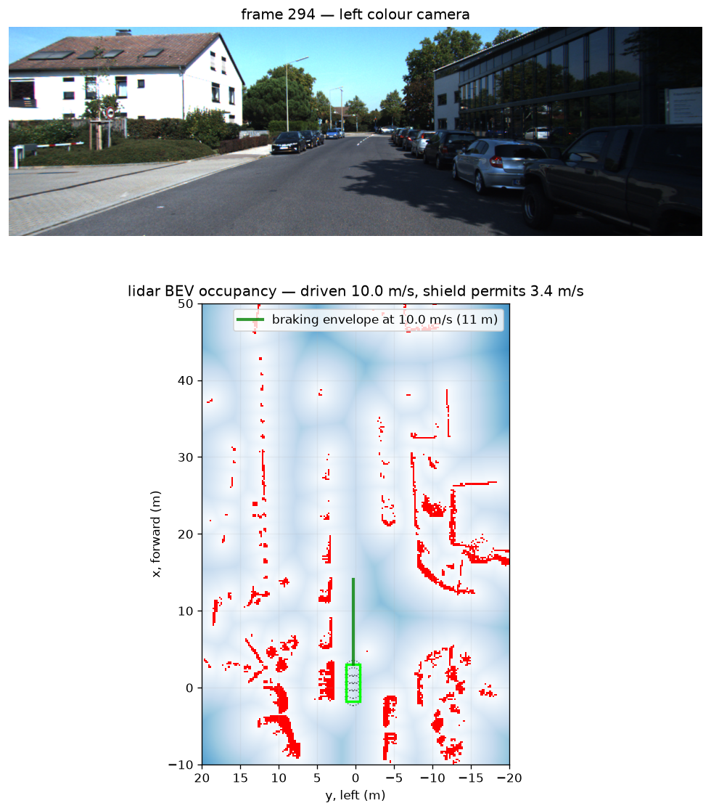
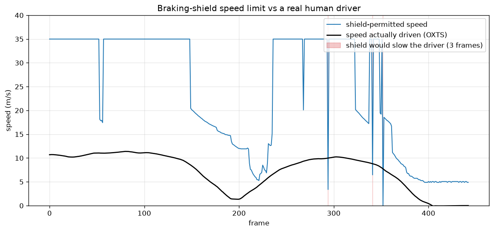
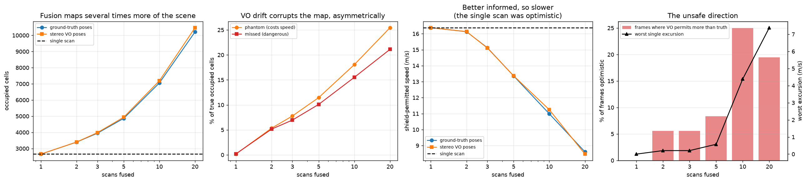
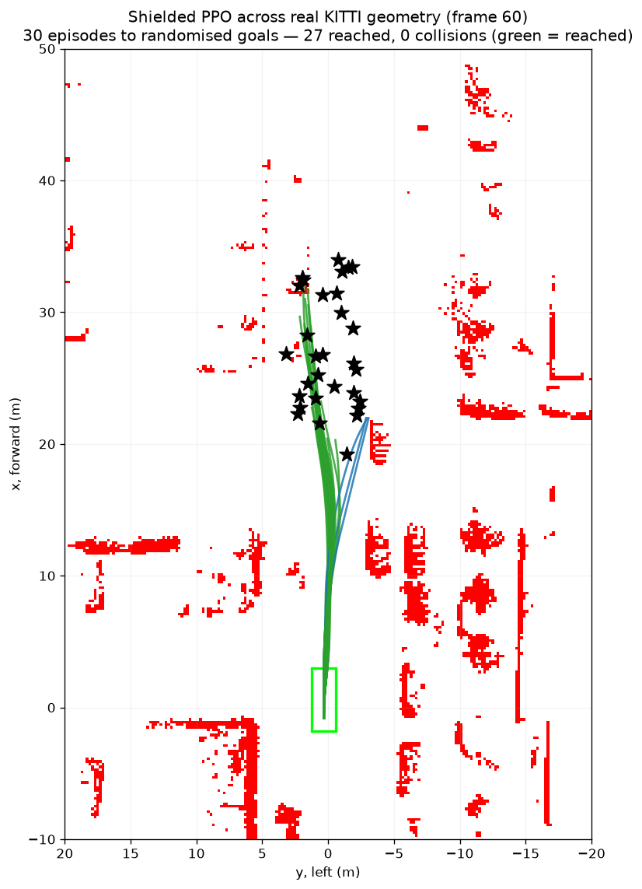

# kitti-nav

Autonomous-driving navigation on real recorded drives: replay a KITTI sequence, build the
occupancy/BEV representation a real AV stack plans on, and drive a vehicle through it behind
a **hard safety shield** that provably cannot admit a collision it could have braked out of.

Runs entirely on a laptop — pure NumPy + OpenCV, no GPU, no simulator install.

> **Why occupancy and not Gaussian splats?** Production AV stacks make live driving decisions
> on lidar/occupancy/BEV grids, not photorealistic reconstructions. Splatting's real role in
> AV work is *offline* — turning recorded drives into replayable digital twins for
> closed-loop testing. This repo keeps the live path on occupancy from the start.

## Status

| Piece | State |
| --- | --- |
| Kinematic bicycle (Ackermann) vehicle model | done |
| Braking-aware safety shield | done — a fuzz test found a real soundness bug in it |
| KITTI raw loading (stereo + lidar + OXTS ground truth) | done |
| Stereo visual odometry (ORB + PnP) | done — **3.55% drift over 332.8 m at 26 fps CPU** |
| Lidar → BEV occupancy + distance field | done — **4.3% occupancy, 2.1 ms/frame** |
| Shield running natively on real lidar | done — **6 ms/frame end to end** |
| Learned planner behind the shield | done — **78% success, 0 collisions on real KITTI** |
| VO poses + lidar fused into an accumulated map | done — **1.9× the scene mapped at 5 scans** |
| Planner driving the accumulated map | done — **still 0 collisions shielded, on harder geometry** |
| Free-space carving + occupied/free/unknown map | done — **carving wins back ~4 of ~12 lost points; shield still 0 collisions, even on a fully-honest map** |
| Cautious speed cap on unknown space | done — **honest map drivable: 4% → ~37% success, shield still 0 collisions** |
| Object tracklets crediting carving | done — **0009 has 12 real movers; carving retires 9% of trail, keeps 96% of the actor** |
| Dynamic shield (braking for a moving obstacle's path) | done — **static shield crashes a crossing car it stops clear of; binds on 8% of real mover-frames** |
| Closed-loop dynamic traffic (movers step while a policy drives) | done — **on 0009's crossing cars the static shield drives in 51×, the dynamic shield 4×; its residual hits are movers striking a stopped ego, all ics-flagged** |
| Evasive steering (swerve out of an ICS rather than brake into it) | done, opt-in — **cleanly avoids an open-road obstacle it can't brake for; marginal on cluttered real traffic (46 → 45)** |

**195 tests pass.** Dataset-backed tests skip cleanly when KITTI isn't downloaded; the
environment core is pure NumPy and tests without any RL stack installed.

## Quickstart

```bash
pip install -r requirements.txt
python3 scripts/fetch_kitti.py               # ~1.7 GB, drive 0009; --list for other options
python3 -m pytest tests/ -q

python3 scripts/eval_odometry.py --plot docs/trajectory.png
python3 scripts/render_bev.py --frame 294 --speed-profile docs/speed_profile.png
python3 scripts/eval_mapping.py --sweep 1 2 3 5 10 20 --max-speed 21 --plot docs/mapping.png
```

Data lands in gitignored `data/kitti_raw/`. Drive `2011_09_26_0009` is 447 frames covering
**332.8 m** at up to **11.4 m/s**, with a 0.533 m stereo baseline and ~122k Velodyne points
per frame. (It ships only **443** lidar scans for those 447 images — real datasets have
holes, so anything iterating lidar bounds on `n_velodyne`.)

---

## What this takes from gsplat-rt, and what it doesn't

This repo is a deliberate branch off [**gsplat-rt**](https://github.com/matthewhamilton3141/gsplat-rt),
a real-time TensorRT Gaussian-splat SLAM project by the same author. That project ended with
two finished arcs: a VGGT-style reconstruction model taken to TensorRT (1.187× whole-model
speedup from two compounding levers), and a navigation-RL flagship whose capstone result was
that **training a policy through a hard safety shield dominated the unshielded policy on
every axis** (100% success / 0 collisions / fewer steps, vs 98% / 4 / more).

That shield result is the seed of this repo. The interesting question was whether the idea
survives contact with *driving* — a different vehicle, different speeds, different sensors.
Mostly it did, but almost nothing transferred unchanged.

### Reused as-is (the design, not the code)

- **The shield concept**: a runtime filter wrapping *any* controller, learned or hand-written,
  requiring no retraining. `predict_pose` / `clearance_at` / `safety_shield` from
  `src/isaac/nav_sim.py` set the shape of `vehicle.py`.
- **One integrator, shared by the simulator and the shield's lookahead.** A filter that
  predicts differently than the world integrates is unsound, so `step_state` is used by both.
- **Pure-NumPy, laptop-testable cores.** gsplat-rt's discipline of keeping the durable logic
  free of GPU/torch/gym dependencies is what makes this repo runnable with no setup.
- **The pluggable front-end seam** in the odometry. gsplat-rt used exactly this to swap ORB
  for a TensorRT SuperPoint+LightGlue front-end without touching any geometry.
- **Measure, don't assume; correct claims downward.** Every number in this README was
  produced by a script in `scripts/`.

### Rebuilt, because a car breaks the assumptions

**The safety shield could not be ported.** Two independent reasons:

1. **A car cannot rotate in place.** The diff-drive shield's escape hatch was "forbid forward
   motion and let it spin — spinning can't collide." But a bicycle model's yaw rate is
   `v/L·tan δ`, which is *also* zero at `v = 0`. Stopping is still safe; it is no longer free.
2. **One-step lookahead is not a safety guarantee at speed.** At 12 m/s braking at 4.5 m/s²,
   stopping takes ~16 m while one 0.1 s control step covers 1.2 m. A next-pose check finds
   every step clear right up until none are.

`test_one_step_shield_crashes_where_braking_shield_stops` reimplements the naive port
faithfully and **drives it into a wall**, in the same scene where the rebuilt shield stops
clean. The failure is demonstrated, not asserted.

**Stereo deleted an entire subsystem.** gsplat-rt estimated depth with a monocular network,
whose output is only defined up to scale — it needed a whole `monocular_scale.py` stage, and
residual scale drift dominated its error. Here `depth = fx·b/disparity` is metric by
construction. Nothing to estimate, nothing to drift. Consequently the evaluation applies **no
Sim(3) alignment**: fitting a scale factor is correct for monocular VO and would be
self-flattery here.

**Circular obstacles became an occupancy grid.** gsplat-rt's world was circles on a plane.
Real lidar is not, so the shield now talks to an `ObstacleField` interface, and `BEVGrid`
implements it directly. Occupancy is never approximated by circles — that would discard
exactly the arbitrary shape occupancy represents well.

### Deliberately left behind

Gaussian splats as a live representation (see the note at the top), the whole monocular
scale-recovery stack, the TensorRT/CUDA layer (this is CPU-only by design), and the
diff-drive kinematics.

---

## The safety shield

`src/kitti_nav/vehicle.py` wraps any controller and filters its commands. It asks a strictly
stronger question than a next-pose check:

> After taking this action, does a **full-braking rollout** from the resulting state still
> stop clear?

An action is admitted only if the answer is yes. That makes the invariant **inductive**: from
a certified state, full braking is always still certifiable, so the shield never has to admit
a collision. This is the inevitable-collision-state / reachability argument (Fraichard &
Asama 2004; the reasoning behind RSS), implemented from the concept.

### A bug worth keeping in the record

The first version modulated throttle and passed steering straight through. That is unsound,
and a randomised rollout test caught it: the braking certificate is issued under the
*current* wheel angle, so if the policy commands a different angle next step, full braking
can curve into an obstacle the certificate never covered. The shield now falls back to
holding the last certified steer, which induction guarantees is stoppable. Kept as
`test_shield_falls_back_to_the_held_steer_rather_than_obeying_a_fatal_one`.

I would not have found this by hand — every scenario worth writing by hand has the policy
steering sensibly. It is the argument for property-based testing in one bug.

**Stated limitations:** by default the shield chooses between the commanded steer and the held
steer and otherwise brakes. Opt-in **evasive steering** (`n_evasive_steers > 0`) removes that
restriction — see below. The footprint is a conservative disc cover, which inflates the car
~0.12 m per side and ~0.55 m past each bumper.

### Evasive steering

When neither the commanded nor the held wheel angle can certify a stop — the situation the shield
would otherwise meet by braking blindly and flagging an inevitable-collision state — an opt-in
third pass searches a fan of steer angles for one whose braking rollout *is* clear, and swerves
instead of crashing. It stays sound because every candidate is admitted through the same
`can_stop_safely` certificate, issued under the very angle it commands, so the successor still
carries a held-steer braking trajectory and the induction is untouched; it can only convert
collisions into safe stops. On an open road it works cleanly — doing 13 m/s at a car 16 m ahead
(inside the ~19 m stopping distance, an ICS for braking), the braking-only shield drives in while
the evasive shield steers past with margin to spare (`test_evasive_steering_avoids_a_collision…`).
On **real** 0009 traffic the gain is small (dynamic-shield collisions 46 → 45 over 200 episodes):
the residual collisions there are mostly a mover striking an *already-stopped* ego, and a real
street is laterally cluttered, so the room a swerve needs is usually already occupied. Off by
default; the rate limiter in `step_state` means a large angle is a command realised as a sustained
brake-turn, not an instant heading change.

### Reasoning about motion

The static shield treats every obstacle as frozen, which is a safety error when the world moves.
`dynamics.dynamic_safety_shield` **time-indexes** the same braking rollout: through the stop, the
obstacles advance along their velocity, so the certificate becomes "can I stop clear of where the
car *will be*." `nav_env.DynamicNavEnv` closes this into a full episode — obstacles step while a
policy drives — and `KittiDynamicScenes` mines drive 0009 for the 91 frames where a labelled car
crosses into the ego's path. Across 200 episodes there, the **static shield drives into a crossing
car 51 times; the dynamic shield, 4** — and its residual collisions are movers striking an ego
that had already braked to a stop (unavoidable by braking, all `ics`-flagged, never a silent
hit). This is the moving-world analogue of the static shield's zero-collision guarantee, sound to
the extent the constant-velocity prediction holds. Velocity is fed from the object tracklets, not
label-free estimation — which is ~95% false-positive on parked cars, a measured perception wall
([`scripts/RESULTS.md`](scripts/RESULTS.md)).

---

## Stereo visual odometry


Full 447-frame drive, against OXTS ground truth:

| metric | value |
| --- | --- |
| ATE RMSE | 6.83 m |
| final drift | 11.82 m over 332.8 m — **3.55%** |
| speed | 16.9 s for 447 frames — **26.4 fps**, single-threaded CPU |
| tracking | 1064 mean matches, 377 mean PnP inliers, **0 fallback steps** |

ORB → ratio-tested matching → back-project through stereo depth → `solvePnPRansac` → compose.

**What 3.55% honestly is:** respectable frame-to-frame VO, clearly *not* state of the art.
No bundle adjustment, no keyframing, no loop closure, so error accumulates monotonically —
exactly what the plot shows. Known levers: local bundle adjustment, keyframing, and a learned
front-end (SuperPoint+LightGlue beat ORB in gsplat-rt, 3.5 cm vs 5.7 cm ATE on TUM).

One trap worth naming: ground truth needs `T_cam2_imu` composed onto the OXTS `T_w_imu`. The
IMU and camera are ~1.1 m and a ~90° rotation apart, so comparing VO against raw OXTS
**manufactures a large fake error**. Cross-checked against integrated OXTS speed.

---

## BEV occupancy from lidar



Velodyne scans (~122k points) rasterise into a top-down grid at **2.1 ms/frame**, everything
staying in the lidar frame (+x forward, +y left) — which is already the bicycle model's frame,
so the planner consumes the grid with no axis juggling.

### Ground removal, chosen by measurement

Removing road returns is the whole ballgame; without it the grid is uniformly occupied. Two
strategies are implemented and the default was picked by measuring, not assuming:

| mode | occupied (frame 0) | occupied (drive mean) | clearance 30 m ahead | time |
| --- | --- | --- | --- | --- |
| `plane` — fixed height band above a global ground height | 3.65% | 8.23% | **2.58 m** | **1.3 ms** |
| `height_diff` — local per-cell ground *(default)* | **2.40%** | **4.33%** | **5.96 m** | 2.1 ms |

<sub>Re-measured 2026-08-02. An earlier version of this table reported 6.23% / 1.82%
occupancy and had `height_diff` as the *faster* mode. Neither reproduces on the current
code, so both are corrected here. The occupancy figures predate `ground_z` defaulting to
−1.73 m (leaving it unset gives 6.7–7.6%, which brackets the old plane number), and
`height_diff` is in fact the slower mode — it runs two passes plus a min-filter. The
clearance figures do reproduce (2.58 m exactly; 6.04 → 5.96 m).</sub>

KITTI documents the lidar 1.73 m above the ground, but near-field returns on this drive
spread ~0.4 m in `z` and are visibly bimodal — sensor pitch plus real road slope — so no
single constant is right across the scan. The plane mode's extra cells are road surface
drifting out of the band: **phantom obstacles that would brake the car for open road.** The
per-cell estimate follows the road instead. It costs 0.8 ms more, which is not the binding
constraint at 10 Hz, and buys half the occupancy and 2.3× the forward clearance.

Ground is estimated over a small *neighbourhood* rather than a single cell, because many
cells hold no ground return at all (lidar rings spread with range; nothing under an overhang
reaches the road) and would otherwise treat the structure above them as their own floor.
A stated limitation: an overhang wider than that window still reads as an obstacle — safe
direction, but wrong.

### The shield's speed limit vs a real human driver



`max_safe_speed` bisects `can_stop_safely` to express the shield as a speed limit, directly
comparable to what the driver actually did. Over the whole drive (speed cap raised to 35 m/s
so geometry rather than the cap is what binds):

- median permitted **35.0 m/s** vs driven 9.0 m/s — on open road the shield does not bind
- it would have slowed the driver on **3 of 443 frames**

Those 3 frames are informative. At frame 294 the car threads a gap between parked cars with
only **0.03 m** of modelled clearance — well inside the 0.30 m safety margin — so the shield
permits just 3.4 m/s where the human drove 10.0 m/s. That is not a bug; it is the price of a
hard guarantee computed with a conservative footprint and a straight-line braking path, while
the human steered through a curve they could see was fine.

**A geometry bug this exposed.** The Velodyne is roof-mounted **0.81 m ahead of the rear
axle**, and the bicycle model's pose *is* the rear axle. Placing the vehicle at the lidar
origin pushed a 4.77 m car most of a metre too far forward and corrupted every clearance
query. Fixing it (plus tightening the disc cover from 3 to 5 discs) moved median permitted
speed 19.8 → 35.0 m/s and dropped binding frames from 15 → 3.

---

## Fusing odometry into the map



Until this point the repo had two good halves that never spoke. `odometry.py` estimated a
trajectory nothing consumed; `bev.py` built the planner's map from a **single frozen scan**,
discarding everything the sensor saw a tenth of a second earlier. `mapping.py` joins them:
scans are transformed into the current Velodyne frame through the estimated poses and
rasterised together.

Three maps are built at each frame and compared — one scan (the old behaviour), accumulation
with OXTS **ground-truth** poses (the ceiling), and accumulation with this repo's **stereo
VO** (the honest number). 36 frames of drive 0009, speed cap 21 m/s:

| scans fused | pose error *over the window* | scene mapped | IoU vs GT-pose map | real cells lost | permitted speed, GT / VO | frames VO is optimistic |
| ---: | ---: | ---: | ---: | ---: | ---: | ---: |
| 1 | 6.8 cm | 1.00× | 0.997 | 0.19% | 16.38 / 16.38 | 0/36 |
| 2 | 10.9 cm | 1.28× | 0.902 | 5.14% | 16.13 / 16.14 | 2/36 (+0.21) |
| 3 | 15.0 cm | 1.50× | 0.866 | 6.96% | 15.13 / 15.11 | 2/36 (+0.21) |
| **5** | **24.1 cm** | **1.86×** | **0.811** | **10.10%** | **13.36 / 13.37** | **3/36 (+0.57)** |
| 10 | 45.5 cm | 2.71× | 0.724 | 15.51% | 10.99 / 11.25 | 9/36 (**+4.39**) |
| 20 | 84.4 cm | 3.94× | 0.639 | 21.11% | 8.61 / 8.47 | 7/36 (**+7.38**) |

The `window = 1` row is the control: with one scan the pose cannot matter, so all three maps
must agree, and they do. Anything else there would be a transform bug rather than a result.

**Global drift is the wrong thing to worry about.** VO ends the drive 12.06 m from truth —
3.55% — which sounds fatal for map-building. It isn't, because a fused map never composes
poses across more than its own window. What governs it is the *relative* pose error over
those few tenths of a second: 24 cm at five scans, two orders of magnitude below the global
figure. That is why the VO column tracks the ground-truth column almost exactly up to five
scans (13.37 vs 13.36 m/s permitted).

**The single-scan map was optimistic because it was blind.** It permits 16.38 m/s while the
five-scan ground-truth map permits 13.36, and that gap is not the fused map being timid: the
single scan is missing **44% of the occupied cells** the fused map contains. Connecting
odometry to the map makes the planner slower and better informed, in that order.

**Where it breaks.** Between 5 and 10 scans the unsafe direction turns on sharply — frames
where the VO map permits *more* speed than the ground-truth map go 3/36 to 9/36, and the
worst excursion goes +0.57 to +4.39 m/s. Five scans is the operating point this drive
supports.

Errors are reported split by direction rather than as one similarity score, because they are
not equally bad. **Phantom** cells (invented by mis-registration) cost speed and cannot cause
a crash; **missed** cells are real geometry the map lost, and only those can hurt. A single
IoU would let the second hide inside the first.

### The bug this found: the car mapping itself as a wall

Accumulation initially drove the shield-permitted speed from 25.1 m/s to **2.2 m/s**, with
phantom obstacles inside the vehicle's own footprint — and it did so with *perfect* poses, so
it was never drift.

A roof-mounted Velodyne sees its own car: the hood, the roof rails, the mirrors. In a single
scan those cells contain *only* bodywork, so `bev.py`'s per-cell ground estimate takes the
bodywork as the ground, measures no height above it, and calls the cell free. **The map was
right by accident.** Accumulate two scans and an earlier viewpoint supplies the road surface
at that spot — seen from behind, before the car arrived — so the cell now holds road at
−1.73 m and bodywork at −0.92 m. That 0.81 m spread reads as an obstacle.

The fix is standard lidar-stack self-filtering: drop returns inside a box around the sensor,
in the sensor's own frame, before any pose transform. The box is *measured* rather than
derived from the vehicle rectangle — the body rectangle is anchored at the rear axle, 0.32 m
off the lidar centreline, while the self-returns are symmetric about the sensor and reach
1.5 m laterally, past the 0.91 m half-width, because roof rails and mirrors are not part of
the body. `scripts/eval_mapping.py --audit-ego` re-derives it from the data, and a test
fails if it drifts. Cost on a single scan: 41 returns, **zero** occupancy cells changed.

Two things had to be right to find it. The self-returns are identified by persisting at a
*fixed position in the sensor frame*, and roadside structure does that too while the car
holds its lane — searching without a lateral bound returns a kerb line at y ≈ −2.3 m present
in 100% of scans.

### Stated honestly

- **Dynamic actors are a confound, and now a measured one.** Some of the occupancy accumulation
  adds is moving traffic smeared into trails, not revealed static geometry. Free-space carving
  (ray-casting each scan to clear what it saw through) is the standard fix and is implemented —
  height-aware, so a beam over a car's roof can't erase the car, with an occupied/free/unknown
  tri-state replacing `outside_is_free`. The map-vs-GT metric can't credit it (carving both maps
  cancels the benefit), but on the planner it wins back ~4 of the ~12 points fusion cost the PPO
  policy (66% → 70%), and — using KITTI **object tracklets** (0009 has 12 genuinely-moving
  actors, so it is *not* too static) — carving is credited directly: it retires 9% of a moving
  actor's trail while keeping 96% of where the actor actually is. Cranking it forgets more trail
  but starts erasing the present actor, because the same height gate that keeps carving safe also
  caps its forgetting. The shield holds **0 collisions** on every version of the map throughout.
  Details and numbers in [`scripts/RESULTS.md`](scripts/RESULTS.md).
- **The honest map is unnavigable if you wall the car out of the unknown — but drivable if you
  slow it down instead.** Treating every unobserved cell as an obstacle is *sound* (the shield
  still never crashes) but leaves no path to a 20–35 m goal across a map that is >50% unknown:
  4% success. The fix is to let the car **cross** unmapped space while a governor caps its
  speed to what it could brake out of before the confidently-free frontier — it never enters
  the unknown faster than it could halt at its threshold. That, plus closing the sensor-sparsity
  holes in observed road (unknown cells enclosed by known-free cells), lifts success to **~37%**
  with the shield still at **0 collisions**. The remaining gap to assuming-unknown-is-free
  (60–70%) is the honest price of respecting what the sensor did not see, now measured. The
  collision certificate is untouched — the governor only ever slows the car, so a certified
  state stays certified.
- **The far field runs out of grid.** The largest optimistic excursions are obstacles near
  `x_max = 50 m` that drift moves across the boundary, where `outside_is_free=True` reads
  them as clear. This is also why the sweep caps speed at 21 m/s: `sqrt(2 · 4.5 · 50)` is the
  fastest the shield can certify with a 50 m map, and any figure above it is the grid's
  assumption talking, not the sensor.

---

## Learned planning behind the shield



A PPO policy (24 forward rays + goal + speed + steering) drives to randomised goals. Both
policies were trained for 600k steps on **synthetic obstacle fields only**, so the KITTI
numbers are a transfer test onto real recorded street geometry. Training is fast enough to
be uninteresting: 1.5 min raw, 5.2 min through the shield, on CPU.

**Real KITTI scenes, 200 episodes** (full tables incl. synthetic: [`scripts/RESULTS.md`](scripts/RESULTS.md)).
The same recorded street, seen two ways — one frozen scan, and five scans fused through the
drive's poses:

| policy | single scan | | fused map (5 scans) | |
| --- | ---: | ---: | ---: | ---: |
| | success | collisions | success | collisions |
| gap-following heuristic | 66% | 68 | 59% | 82 |
| gap-following + shield | 66% | **0** | 54% | **0** |
| PPO (raw) | 78% | 42 | 66% | 67 |
| PPO (raw) + shield at eval | 75% | **0** | 62% | **0** |
| PPO trained *through* the shield | 78% | **0** | 64% | **0** |

**The shield's guarantee held in every run: 0 collisions, always** — over a heuristic that
crashes 68 times unaided, a learned policy that crashes 42 times unaided, and (in tests)
uniformly random actions. It does not depend on the policy being any good, which is the
whole point of a runtime shield.

**And it held on the harder map without being told anything had changed.** The fused column
is the same policies, untouched, meeting geometry a single scan is blind to: unshielded
collisions rise (42 → 67 for PPO) and success falls 12–14 points, while every shielded row
stays at exactly 0. The shield is not a policy — it re-derives a braking certificate from
whatever occupancy it is handed, so more obstacles make it more conservative rather than
less sound. The success drop is the cost of that conservatism against real obstacles the
planner previously could not see, and is not a regression: the single-scan map was permitting
16.38 m/s while missing 44% of the occupied cells the fused map contains.

Shielding a learned policy turns out to be nearly free, and on synthetic scenes it *improves*
success (66% → 70%). That reads oddly until you notice a collision ends the episode as a
failure: the shield converts would-be crashes into driving that sometimes still reaches the
goal.

### A negative result, replicated across 5 training seeds

**Training through the shield did not beat simply bolting it on at evaluation — contradicting
what gsplat-rt found.** There, shield-in-the-loop strictly dominated (100%/0/56 vs 98%/4/58).

This is a claim about a *training method*, so the unit of replication has to be the training
run, not the episode — a single run cannot separate a real effect from one lucky weight
initialisation. Five independently seeded policies per configuration, each scored on the
**same** 200 evaluation scenes:

| scenes | PPO (raw) + shield at eval | PPO trained through shield | difference |
| --- | --- | --- | --- |
| synthetic | 71.9% ± 1.5% | 72.0% ± 2.9% | +0.1%, 95% CI [−3.5, +3.7], p = 0.95 |
| KITTI (real) | 76.2% ± 1.0% | 77.3% ± 1.2% | +1.1%, 95% CI [−0.5, +2.7], p = 0.14 |

Neither is significant, and **0 collisions in all 10 runs**.

The interval matters more than the p-value here. On KITTI it caps any real effect at **+2.7
points**, and 4 of 5 seeds do favour in-loop training — so a small genuine benefit isn't
excluded, and "not significant" isn't "no effect." What *is* excluded is anything near the
magnitude gsplat-rt reported. The defensible claim: **not that in-loop training never helps,
but that its large win there does not reproduce here.**

Why: eval-time shielding already costs this policy nothing (on synthetic scenes it *helps*),
so there's no penalty left for in-loop training to recover. In gsplat-rt the shield *did*
cost real performance bolted on (98%/4 → 95%/0, 58 → 79 steps), and closing that gap is what
in-loop training achieved. A shield that is already free leaves nothing on the table.

Seed-to-seed spread came out small (1.0–2.9 points), well under the deep-RL norm where seed
variance swamps algorithmic differences — which is why 5 seeds sufficed to bound the effect.
Caveats remain: one drive, one hyperparameter set, 600k steps.

## Layout

```
src/kitti_nav/vehicle.py     bicycle model, footprint geometry, braking shield
src/kitti_nav/kitti.py       KITTI raw access: calibration, stereo, OXTS ground truth
src/kitti_nav/stereo.py      SGBM disparity -> metric depth
src/kitti_nav/odometry.py    ORB + PnP visual odometry, trajectory evaluation
src/kitti_nav/bev.py         lidar -> BEV occupancy + distance field (ObstacleField)
src/kitti_nav/mapping.py     pose + scan fusion into an accumulated map; ego self-filter
src/kitti_nav/nav_env.py     driving nav environment + scene sources + baseline policy
src/kitti_nav/nav_gym.py     the only module importing gymnasium
scripts/fetch_kitti.py       dataset download (data is never committed)
scripts/eval_odometry.py     run VO over a drive, score it, plot it
scripts/eval_mapping.py      single vs GT-pose vs VO-pose maps; --audit-ego, --sweep
scripts/render_bev.py        BEV / shield / policy-rollout visualisations
scripts/train_ppo.py         PPO training, optionally through the shield
scripts/eval_policies.py     the comparison table
scripts/RESULTS.md           full results writeup
tests/                       pure-NumPy unit tests; dataset tests skip when data is absent
```

## Attribution

Built on KITTI (Geiger et al., **CC BY-NC-SA 3.0 — non-commercial**, not redistributed here)
and pykitti (MIT). Full credits, licenses, and citations in [`ATTRIBUTION.md`](ATTRIBUTION.md).
Code in this repo is MIT; that covers the code only, not the dataset.
