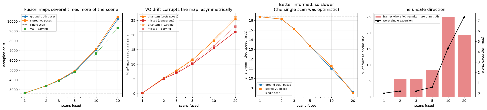

# Learned planning behind a braking safety shield — results

All numbers produced by `scripts/eval_policies.py` and `scripts/eval_seeds.py` on this
machine (CPU only). Every PPO policy was trained for 600k steps on **synthetic** obstacle
fields only — the KITTI tables are therefore a transfer test onto real recorded street
geometry, never trained on.

Training cost, measured across the 10 runs of the seed sweep: raw PPO **1.5–1.7 min**,
shield-in-the-loop PPO **4.8–5.4 min** (8 parallel envs, CPU).

## Synthetic scenes (200 episodes)

| policy | success | collisions | reward | steps |
| --- | ---: | ---: | ---: | ---: |
| gap-following heuristic | 24% | 151 | 3.2 | 31 |
| gap-following + shield | 39% | **0** | 21.9 | 34 |
| PPO (raw) | 66% | 50 | 29.7 | 37 |
| PPO (raw) + shield at eval | 70% | **0** | 35.5 | 41 |
| PPO trained *through* the shield | 68% | **0** | 34.7 | 38 |

## Real KITTI scenes — transfer, never trained on (200 episodes)

One frozen Velodyne scan per scene.

| policy | success | collisions | reward | steps |
| --- | ---: | ---: | ---: | ---: |
| gap-following heuristic | 66% | 68 | 26.0 | 27 |
| gap-following + shield | 66% | **0** | 31.5 | 29 |
| PPO (raw) | 78% | 42 | 32.3 | 28 |
| PPO (raw) + shield at eval | 75% | **0** | 34.5 | 29 |
| PPO trained *through* the shield | 78% | **0** | 35.4 | 29 |

## Real KITTI scenes, accumulated map — 5 scans fused (200 episodes)

Same drive, same policies, same episodes. The only change is that each scene is built by
fusing five scans through the drive's poses instead of freezing one, so the planner sees
geometry a single scan is blind to.

| policy | success | collisions | reward | steps |
| --- | ---: | ---: | ---: | ---: |
| gap-following heuristic | 59% | 82 | 21.7 | 28 |
| gap-following + shield | 54% | **0** | 26.2 | 28 |
| PPO (raw) | 66% | 67 | 25.7 | 28 |
| PPO (raw) + shield at eval | 62% | **0** | 29.9 | 29 |
| PPO trained *through* the shield | 64% | **0** | 30.3 | 29 |

## What holds

**The shield's guarantee is absolute across every run: 0 collisions, always.** That covers a
weak heuristic that crashes 151 times unaided, a learned policy that crashes 50 times
unaided, and (in the unit tests) uniformly random actions. The guarantee does not depend on
the policy being any good, which is the entire point of a runtime shield.

**It also held when the map got harder underneath it, with no retraining and no notice.**
The accumulated-map table is the same policy weights meeting denser geometry: unshielded
collisions rise (42 → 67 for raw PPO, 68 → 82 for the heuristic) and success falls 12–14
points, while every shielded row stays at exactly 0. The shield is not a policy — it
re-derives a braking certificate from whatever occupancy it is handed, so extra obstacles
make it more conservative rather than less sound. This is the strongest evidence here that
the guarantee is a property of the method rather than of the scenes it was tuned on.

**The success drop on the fused map is not a regression.** The single-scan map is missing
44% of the occupied cells the five-scan map contains, and permits 16.38 m/s where the fused
map permits 13.36 (`scripts/eval_mapping.py`). The old numbers were partly measuring the
map's blindness. The fused numbers are the honest ones for a planner that has seen the
street; the single-scan table is kept because it is what every earlier result was measured
against, including the 5-seed negative result below.

**Learning clearly beats the heuristic.** 24% → 66% success on synthetic scenes, 66% → 78%
on KITTI.

**The transfer to real geometry works.** A policy that has only ever seen random circles
handles recorded streets. Note the KITTI numbers are *higher* than synthetic, which is not
evidence the policy is better there — a recorded street has a genuinely drivable corridor
(a car drove down it), whereas the synthetic generator scatters obstacles arbitrarily,
including directly across the path. Synthetic is the harder distribution.

**Shielding a learned policy is nearly free**, and on synthetic scenes it *improves* success
(66% → 70%). That reads oddly until you notice collisions terminate an episode as a failure:
the shield converts would-be crashes into continued driving that sometimes still reaches the
goal. Safety and success are not in tension here the way they are for the heuristic.

## What does not hold — a negative result, tested across 5 training seeds

**Training through the shield did not beat bolting it on at evaluation, contradicting what
`gsplat-rt` found.** There, the shield-in-the-loop policy strictly dominated the raw one on
every axis (100%/0 collisions/56 steps vs 98%/4/58).

This claim is about a *training method*, so the unit of replication has to be the training
run, not the episode. Five independently seeded policies were trained per configuration
(`scripts/eval_seeds.py`), each scored on the **same** 200 evaluation scenes so scene
difficulty cannot contribute to the difference.

### Synthetic scenes

| policy | per-seed success | mean ± sd | collisions |
| --- | --- | --- | ---: |
| PPO (raw) + shield at eval | 70.5 / 71.0 / 73.5 / 71.0 / 73.5 | **71.9% ± 1.5%** | 0 |
| PPO trained through shield | 67.5 / 73.5 / 75.0 / 71.0 / 73.0 | **72.0% ± 2.9%** | 0 |

Difference **+0.1%**, 95% CI **[−3.5%, +3.7%]**, Welch *t* = 0.07, **p = 0.95**.

### Real KITTI scenes

| policy | per-seed success | mean ± sd | collisions |
| --- | --- | --- | ---: |
| PPO (raw) + shield at eval | 75.0 / 77.5 / 76.5 / 75.5 / 76.5 | **76.2% ± 1.0%** | 0 |
| PPO trained through shield | 77.5 / 78.5 / 75.5 / 78.0 / 77.0 | **77.3% ± 1.2%** | 0 |

Difference **+1.1%**, 95% CI **[−0.5%, +2.7%]**, Welch *t* = 1.63, **p = 0.14**.

### Reading this honestly

**The negative result survives replication.** Neither comparison is significant at 0.05.

**But the confidence interval says more than the p-value does.** On KITTI the interval caps
any real effect at **+2.7 percentage points**, and 4 of 5 seeds do favour in-loop training —
so a *small* genuine benefit is not excluded, and "not significant" is not "no effect." What
*is* excluded is an effect anywhere near the magnitude `gsplat-rt` reported (95% → 100%
success, 79 → 56 steps). That is the defensible claim: **not that in-loop training never
helps, but that its large win there does not reproduce here.**

**Seed-to-seed spread turned out to be small** — 1.0 to 2.9 points, well below the deep-RL
norm where seed variance routinely swamps algorithmic differences (Henderson et al. 2018).
That makes this comparison better powered than the seed count alone suggests, and it is why
5 seeds were enough to bound the effect usefully.

**The fused map does not overturn it either.** On the accumulated-map table, in-loop training
leads by +2 points (64% vs 62%) — the same small, same-signed gap as on single scans (+3),
comfortably inside the interval above. That is one seed on one scene set, so it is
corroboration rather than evidence; the seed sweep has not been re-run on fused maps. Worth
doing, and cheap (~35 min), if the question is ever revisited.

### Why the difference from gsplat-rt

Visible in the shielding rows above: eval-time shielding already costs this policy nothing
(on synthetic scenes it *helps*), so there is no penalty left for in-loop training to
recover. In `gsplat-rt` the shield *did* cost real performance when bolted on (98%/4 →
95%/0, and 58 → 79 steps), and closing that gap is exactly what training through it achieved.
A shield that is already free leaves nothing on the table.

That is itself explainable: this shield modulates a *continuous* throttle/brake channel and
usually intervenes by scaling acceleration slightly, whereas the diff-drive shield frequently
forced a discrete "stop and rotate in place" that the unshielded policy had never planned for.

**Remaining caveats.** One drive, one hyperparameter set, 600k steps, 5 seeds. Absolute
success rates also shift with the evaluation scene set (a 600-episode set scored the same
seed-0 policies ~5 points lower than the 200-episode set), which is why only within-table
comparisons on identical scenes are meaningful.

## Accumulated mapping — fusing odometry poses into the planner's map

Separate experiment, same drive. Full narrative in the README; the numbers are here.

Three maps per frame: one scan (the behaviour everything above was measured against),
accumulation with OXTS ground-truth poses (the ceiling), accumulation with stereo VO (the
honest number). 36 frames of drive 0009, speed cap 21 m/s — `sqrt(2 · 4.5 · 50)`, the
fastest a 50 m grid can certify a stop from, above which the figure reflects
`outside_is_free` rather than the sensor.

| scans | pose error over window | mapped | IoU vs GT | real cells lost | permitted GT / VO | VO optimistic |
| ---: | ---: | ---: | ---: | ---: | ---: | ---: |
| 1 | 6.8 cm | 1.00× | 0.997 | 0.19% | 16.38 / 16.38 | 0/36 |
| 2 | 10.9 cm | 1.28× | 0.902 | 5.14% | 16.13 / 16.14 | 2/36 (+0.21) |
| 3 | 15.0 cm | 1.50× | 0.866 | 6.96% | 15.13 / 15.11 | 2/36 (+0.21) |
| **5** | **24.1 cm** | **1.86×** | **0.811** | **10.10%** | **13.36 / 13.37** | **3/36 (+0.57)** |
| 10 | 45.5 cm | 2.71× | 0.724 | 15.51% | 10.99 / 11.25 | 9/36 (+4.39) |
| 20 | 84.4 cm | 3.94× | 0.639 | 21.11% | 8.61 / 8.47 | 7/36 (+7.38) |

What holds:

- **`window = 1` is an exact control.** One scan, so the pose cannot matter, and all three
  maps agree (IoU 0.997, identical permitted speed). A discrepancy there would be a
  transform bug rather than a finding.
- **Global drift is the wrong statistic.** VO ends 12.06 m off (3.55%), but a fused map only
  ever composes poses within its window, so what governs it is the relative error over a few
  tenths of a second — 24 cm at five scans. Two orders of magnitude apart, and it is why the
  VO column matches the ground-truth column up to five scans.
- **The single-scan map was optimistic because it was blind.** It permits 16.38 m/s against
  the five-scan map's 13.36 while missing 44% of that map's occupied cells.
- **The knee is between 5 and 10 scans.** Frames where the VO map permits more than truth go
  3/36 → 9/36 and the worst excursion +0.57 → +4.39 m/s.

Errors are split into **phantom** (invented, costs speed, cannot crash) and **missed** (real
geometry lost, the only kind that can hurt) rather than pooled into one similarity score.

What does not hold / is not separated:

- **Dynamic actors are a confound.** Moving traffic smears into trails, and with ground-truth
  poses that is indistinguishable here from revealed static geometry, so "1.86× the scene
  mapped" is an upper bound on the *useful* gain. Free-space carving — the standard fix — is
  now implemented (next section); on this static drive it does not measurably recover the gap,
  and why is itself a result.
- **Far-field excursions are a grid-boundary artefact.** The largest optimistic cases are
  obstacles near `x_max = 50 m` that drift moves across the edge into assumed-free space.

A bug this surfaced, worth its own line: accumulation initially cut permitted speed from
25.1 m/s to **2.2 m/s** with perfect poses, because the roof-mounted Velodyne sees its own
car and fusion supplies the road surface underneath those returns that makes them measure
0.81 m tall. Ego self-filtering fixes it and costs zero occupancy cells on a single scan.

## Free-space carving — implemented, sound, and an honest non-result on this drive

The confound above — moving traffic smeared into permanent walls — now has its standard fix in
the code. Carving (`mapping.fuse_map` with `carve=True`, or `ScanAccumulator` streaming)
ray-casts each scan and retires an occupied cell a later scan saw *through*, and the map gains
an occupied / free / **unknown** tri-state in place of the
single `outside_is_free` flag. It is **height-aware (2.5D)**: a beam clears a cell only where
it crossed the near-ground band `[ground, ground + 0.25 m]`, so a beam that flew *over* a car
on its way to a wall behind it cannot erase the car — the one error class (a lost real
obstacle) that can cause a collision. Carving is **off by default**; every other number in
this file is un-carved.

Soundness is pinned by unit tests where ground truth is exact (`tests/test_mapping.py`): a
moving actor's trail is retired, an obstacle a beam passes over is kept, a static wall
survives every viewpoint, and a never-observed cell reads `unknown` rather than free.

On real drive 0009 the measurement carves **both** the GT-pose and VO-pose maps on purpose: a
GT map smears a moving actor into a trail exactly as a VO map does, so carving only VO and
scoring it against an un-carved GT would book every correctly de-smeared cell as a dangerous
*missed* one. Carving both keeps the reference honest — `missed` still means "real geometry VO
lost to drift". 36 frames, speed cap 21 m/s, `carve_persistence = 2`.

| scans | occupied cells, VO (un-carved → carved) | missed vs GT (un → carved) | worst optimistic excursion |
| ---: | ---: | ---: | ---: |
| 2 | 3401 → 3394 (−0.2%) | 5.14% → 5.15% | +0.21 → +0.21 |
| 3 | 3982 → 3909 (−1.8%) | 6.96% → 7.21% | +0.21 → +0.21 |
| **5** | **4934 → 4802 (−2.7%)** | **10.10% → 10.52%** | **+0.57 → +0.57** |
| 10 | 7189 → 6700 (−6.8%) | 15.51% → 16.24% | +4.39 → +5.00 |
| 20 | 10471 → 9335 (−10.8%) | 21.11% → 22.88% | +7.38 → **+21.00** |

Read this honestly:

- **Carving removes cells, growing with the window** (−0.2% at 2 scans to −11% at 20) —
  consistent with clearing accumulated smear and drift phantoms.
- **But it does not improve the map-vs-GT numbers.** Missed and phantom both tick *up* slightly
  at every window. This is structural, not a bug: carving is applied to both maps, so any
  de-smearing cancels in a VO-vs-GT comparison, leaving only carving's own drift noise. Without
  per-actor labels, occupancy agreement cannot separate a correctly forgotten actor from lost
  geometry, so it cannot credit the thing carving exists to do.
- **At the operating point (5 scans) it is safe and nearly inert** — the unsafe direction is
  unchanged (3/36 frames, worst +0.57 m/s) and missed moves 0.42 pts. Drive 0009 is largely
  static, so there is little to forget and carving correctly does little.
- **At large windows it is a liability.** By 20 scans the worst optimistic excursion jumps
  +7.38 → +21.00 m/s: under 84 cm of window drift, carving removes a real (blurred) obstacle,
  and near the grid boundary that reads as full-speed clearance. This is the "smeared free
  space" failure mode from the module docstring, amplified — reason to keep carving to short
  windows and a conservative `carve_persistence`.

`carve_persistence` (see-throughs needed to retire one occupied observation) is the one knob,
and sweeping it does **not** find a value that both de-smears and keeps missed flat — it only
trades one against the other:

| persistence | w5 missed Δ | w10 missed Δ | w5 cells removed |
| ---: | ---: | ---: | ---: |
| 2 (default) | +0.42 pts | +0.73 pts | 132 (−2.7%) |
| 4 | +0.16 pts | +0.37 pts | 55 (−1.1%) |
| 8 | +0.01 pts | +0.25 pts | 11 (−0.2%) |

The verdict: carving is implemented and sound, but its payoff is **not demonstrable on a
static drive through the map-fidelity metric** — and knowing *why* (the benefit is symmetric,
so it cancels; the drive is too static to have much to forget) is the finding. Where it should
show is a drive with real traffic, or the planner itself. Cost is ~40–350 ms per map (2 to 20
scans), dominated by the march.



### The planner on a carved map (200 episodes)

The map-fidelity metric could not credit carving, so the other place it can show is the
planner. Every policy is the same synthetic-trained one, evaluated on four versions of the
five-scan real map: fused (the accumulated map, unknown assumed free), carved (see-through
cells retired), carved with a **hard** occupied/free/unknown reading where a cell no ray ever
observed is an obstacle for the shield and the rays, and carved with the **cap** reading —
unknown is traversable but the car's speed is governed by how far confidently-free space
reaches ahead, so it never enters unmapped space faster than it could brake out of.

| policy | fused (5) | carved (5) | carved + unknown-blocks | carved + cap |
| --- | --- | --- | --- | --- |
| gap-following | 59% / 82 coll | 60% / 79 | 4% / 192 | 40% / 63 |
| gap-following + shield | 54% / **0** | 56% / **0** | 4% / **0** | 37% / **0** |
| PPO (raw) | 66% / 67 | **70% / 60** | 4% / 172 | 39% / 32 |
| PPO (raw) + shield at eval | 62% / **0** | 62% / **0** | 4% / **0** | 34% / **0** |
| PPO through shield | 64% / **0** | 66% / **0** | 4% / **0** | 36% / **0** |

Four things, in order of how much they matter:

- **The shield holds 0 collisions in every column**, including the degenerate one where the map
  is majority-obstacle and the car can barely move. This is the strongest form of the repo's
  headline: the braking certificate is re-derived from whatever occupancy it is handed, so a
  map that is *more* obstacle only makes it more conservative, never unsound. Handed a map where
  half the world is a wall, it still never admits a collision.
- **Carving wins a little back.** Fusion cost the unshielded PPO ~12 points (78% single → 66%
  fused); carving returns ~4 of them (66 → 70%, collisions 67 → 60), and every other row moves
  the same small, safe direction (never worse). It does *not* recover the whole drop, and it
  should not: most of that drop is real obstacles a single scan was blind to, which carving
  correctly keeps. This is the first positive signal for carving anywhere in the repo — the
  map-fidelity metric could only show its cost.
- **Hard unknown-blocking is unnavigable here (4%).** Treating every unobserved cell as an
  obstacle collapses success across all policies: an accumulated single-drive map is >50%
  unknown (behind the frontier, in occlusion shadows, between rings), so there is no clear path
  to a goal 20–35 m away. It took two fixes just to get off 0% — crediting any cell with a
  return as observed, and exempting the lidar's ~4 m near-field ground blind spot (a roof lidar
  cannot see the road directly under the car; real stacks assume it is drivable) — and even then
  the through-path is walled. The honest reading is *sound* (the shield never lies) but too
  strict to *drive*.
- **The cap reading makes the honest map drivable — 4% → ~37% — with the shield still sound.**
  This is the payoff. Rather than walling the car out of unknown space, the cap lets it *cross*
  unmapped cells but governs its speed by the frontier distance (`v ≤ sqrt(2·a·d)`, the inverse
  of the stopping distance), so it never enters the unknown faster than it could halt at its
  threshold — a governor layered on the collision shield, which is untouched and stays at **0
  collisions on every shielded row**. Two things had to be true for this to work and both are
  measured: (1) collision stays a function of *occupancy alone*, so unknown hugging a corridor
  no longer puts the car's own footprint in collision the way hard-blocking does — that alone
  drops unshielded collisions 5–11× vs the hard column (gap 192 → 63, PPO 172 → 32); and (2) the
  confidently-free corridor has to actually reach the goal, which raw carving does not — a
  single drive's observed road is speckled with unknown between lidar rings, so the corridor
  reaches only a median 10 m. **Closing those enclosed holes** (`MapConfig.close_unknown`, a
  morphological close that fills unknown cells surrounded by observed road but leaves a genuine
  occlusion shadow open) doubles it to a median 21 m, into goal range, without touching
  occupied cells. The remaining gap to unknown-as-free (60–70%) is not a defect — it is the
  honest price of respecting unobserved space instead of assuming it clear, now measured rather
  than assumed. `outside_is_free` remains the optimistic default; the cap is the drivable
  *honest* one.

## Reproduce

```bash
# accumulated mapping (the table above; --audit-ego re-derives the self-filter box)
python3 scripts/eval_mapping.py --sweep 1 2 3 5 10 20 --every 12 --max-speed 21
python3 scripts/eval_mapping.py --audit-ego

# free-space carving: the carved comparison and the persistence sweep
python3 scripts/eval_mapping.py --sweep 1 2 3 5 10 20 --every 12 --max-speed 21 --carve \
  --plot docs/mapping_carved.png
python3 scripts/eval_mapping.py --sweep 5 10 20 --every 12 --carve --carve-persistence 4

# the planner on carved maps: fused vs carved vs carved+unknown-blocks
python3 scripts/eval_policies.py --episodes 200 --carve --fused-window 5

python3 scripts/train_ppo.py --steps 600000 --out models/ppo_raw
python3 scripts/train_ppo.py --steps 600000 --shield --out models/ppo_shielded
python3 scripts/eval_policies.py --episodes 200

# the 5-seed comparison behind the negative result
for s in 0 1 2 3 4; do
  python3 scripts/train_ppo.py --steps 600000 --seed $s --out models/ppo_raw_s$s
  python3 scripts/train_ppo.py --steps 600000 --seed $s --shield --out models/ppo_shielded_s$s
done
python3 scripts/eval_seeds.py --seeds 5 --episodes 200
```
